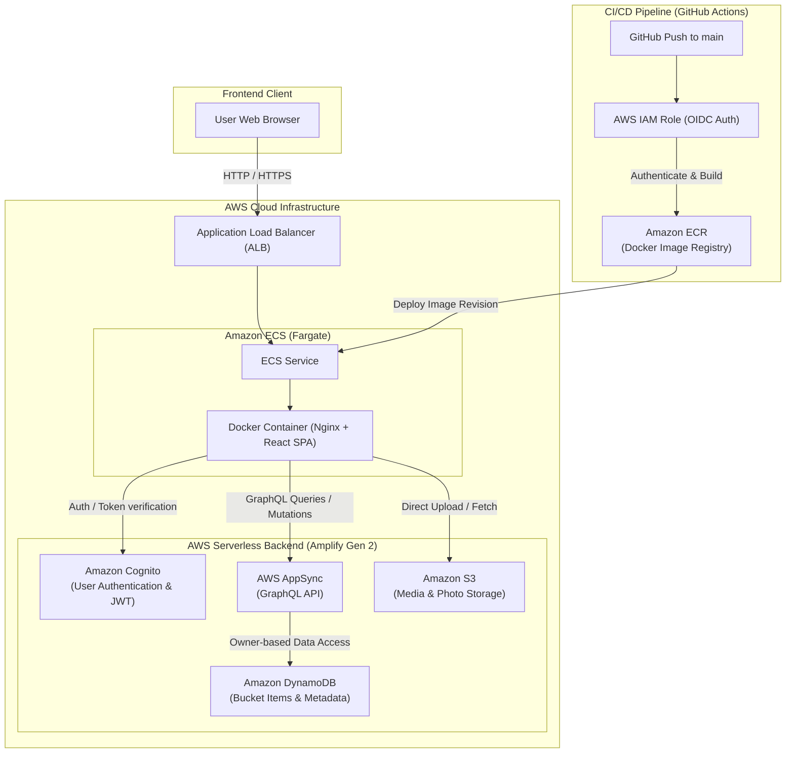

# BucketList Tracker

A modern, full-stack cloud application for tracking life goals, milestones, and travel memories. Built with React, TypeScript, and AWS Amplify Gen 2, containerized with Docker, and deployed on Amazon ECS (Fargate) with a zero-credential GitHub Actions OIDC CI/CD pipeline.

---

## System Architecture



---

## Key Features

- **Personalized Bucket List Management**: Create, categorize, prioritize, and track progress on life goals with target deadlines.
- **Media Attachments**: Securely upload and store milestone photos directly to Amazon S3.
- **Granular Security & Privacy**: Per-user data isolation via Amazon Cognito authentication and DynamoDB owner-level authorization rules.
- **Interactive Analytics**: Real-time completion progress tracking, category distributions, and priority filters.
- **Containerized SPA Delivery**: High-performance multi-stage Docker build served through Nginx with custom routing.
- **Automated Deployments**: Keyless, continuous integration and deployment pipeline using GitHub Actions with AWS OIDC federation.

---

## Tech Stack

| Layer | Technology |
|---|---|
| **Frontend** | React 18, TypeScript, Vite, AWS Amplify UI & SDK |
| **Styling & UI** | Custom CSS (Responsive, Glassmorphism, Dark Mode) |
| **Authentication** | Amazon Cognito User Pools |
| **Database & API** | Amazon DynamoDB, AWS AppSync (GraphQL) |
| **Storage** | Amazon S3 (Bucket list images) |
| **Containerization** | Docker (Multi-stage), Nginx Alpine |
| **Hosting & Compute** | AWS ECS on Fargate, Application Load Balancer (ALB) |
| **CI/CD & Registry** | GitHub Actions (OIDC Auth), Amazon ECR |

---

## Step-by-Step Workflow: From Idea to Production

```
1. Conception & Schema   →   2. Local Dev & Sandbox   →   3. Containerization   →   4. Automated CI/CD
   - Define data models        - Amplify Gen 2 sandbox     - Multi-stage Docker       - GitHub Actions OIDC
   - Design Auth & Storage     - Vite Hot Module Reload    - Nginx SPA routing        - ECR push & ECS deploy
```

### 1. Backend Definition (Amplify Gen 2)
The backend infrastructure is defined purely in code using TypeScript inside the `amplify/` directory:
- `amplify/auth/resource.ts`: Configures Cognito user pools with email-based authentication.
- `amplify/data/resource.ts`: Defines the `BucketListItem` schema with owner-level authorization policies.
- `amplify/storage/resource.ts`: Configures S3 bucket access permissions for authenticated and guest users.

### 2. Frontend Development & Local Testing
- Connects directly to real, isolated AWS resources using `ampx sandbox`.
- Generates `amplify_outputs.json` to keep frontend configuration in sync with deployed cloud resources.

### 3. Build & Containerization
- **Stage 1 (Builder)**: Compiles TypeScript and builds the production React bundle via Vite.
- **Stage 2 (Server)**: Lightweight Nginx Alpine image serves the static assets with fallback routing configured for client-side routing.

### 4. CI/CD & Deployment
- Pushing to the `main` branch triggers `.github/workflows/deploy.yml`.
- The pipeline authenticates to AWS via IAM OIDC without storing persistent AWS credentials in GitHub secrets.
- Builds and pushes the updated container image to Amazon ECR.
- Renders and updates the Amazon ECS Task Definition and initiates a zero-downtime rolling service deployment.

---

## Local Development Setup

### Prerequisites
- **Node.js**: v20 or higher
- **npm**: v10 or higher
- **AWS CLI**: configured with appropriate developer credentials

### 1. Clone & Install Dependencies
```bash
git clone https://github.com/Abdul-Sohaib/BucketList-Tracker.git
cd BucketList-Tracker
npm install
```

### 2. Launch Local Cloud Sandbox
Run the Amplify Gen 2 sandbox to provision cloud development resources in your AWS account:
```bash
npx ampx sandbox
```

### 3. Start Local Frontend Dev Server
In another terminal, start the Vite development server:
```bash
npm run dev
```
Open `http://localhost:5173` in your browser.

---

## Docker & Production Build

### Test Build Locally
```bash
npm run build
```

### Build and Run Docker Container
```bash
# Build the Docker image
docker build -t bucketlist-tracker-web .

# Run the container locally on port 8080
docker run -d -p 8080:80 --name bucketlist-app bucketlist-tracker-web
```
Access the application at `http://localhost:8080`.

---

## Project Structure

```
Bucketlist-tracker-web/
├── .github/
│   └── workflows/
│       └── deploy.yml          # GitHub Actions CI/CD with AWS OIDC
├── amplify/                    # AWS Amplify Gen 2 Serverless Backend
│   ├── auth/resource.ts        # Cognito authentication config
│   ├── data/resource.ts        # GraphQL schema & DynamoDB rules
│   ├── storage/resource.ts     # S3 bucket permissions
│   └── backend.ts              # Amplify backend entry point
├── public/                     # Static assets & icons
├── src/
│   ├── components/             # Reusable UI components (Navbar, Cards, Forms)
│   ├── pages/                  # Route views (Dashboard, Create, Edit, Login, Profile)
│   ├── types/                  # TypeScript data interfaces
│   ├── App.tsx                 # Core application routing & auth wrapping
│   ├── main.tsx                # React DOM mount point
│   └── index.css               # Global styles & design tokens
├── Dockerfile                  # Multi-stage production container build
├── nginx.conf                  # Nginx web server config for SPA routing
├── package.json                # Project dependencies and npm scripts
└── vite.config.ts              # Vite configuration
```

---

## License

This project is licensed under the [MIT License](LICENSE).
